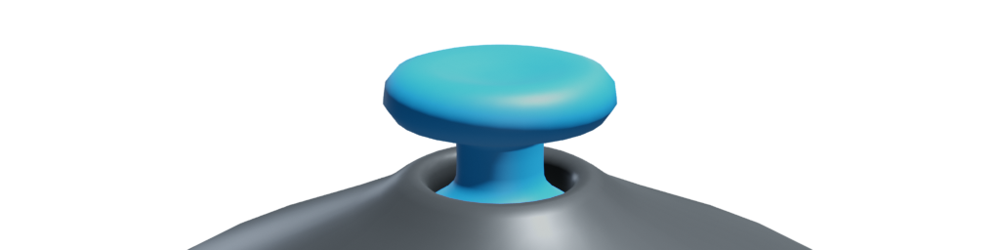

**Viewpad** is a small Godot plugin to control the 3D viewport's camera with your gamepad's axes.

> [!NOTE]
> Requires Godot 4.0.

## Installation

1. Download latest release from [here](https://github.com/vaner-org/viewpad/releases/latest) or [AssetLib](https://godotengine.org/asset-library/asset/XXXX) and place it in your project's `addons` folder.
2. In the toolbar, navigate to Project > Project Settings > Plugins and enable Viewpad.

## Usage

* Use the right stick to rotate the camera.
* Use the left stick to move the camera in local XZ space.
* Use the triggers to ascend or descend the camera in local Y space.

## Configure

In in your project directory's `addons > viewpad > plugin.gd`, you may
* Change the value of `MOVE_SPEED` to any other `float`.
* Change the value of `LOOK_SPEED` to any other `float`.
* Change the value of `DEADZONE` to any other `float`.

## License

Available [here](LICENSE.txt).

## Donation

[<picture><source media="(prefers-color-scheme: dark)" srcset="logo/kofi-dark.svg"></picture>](https://ko-fi.com/E1E8K9QWD)